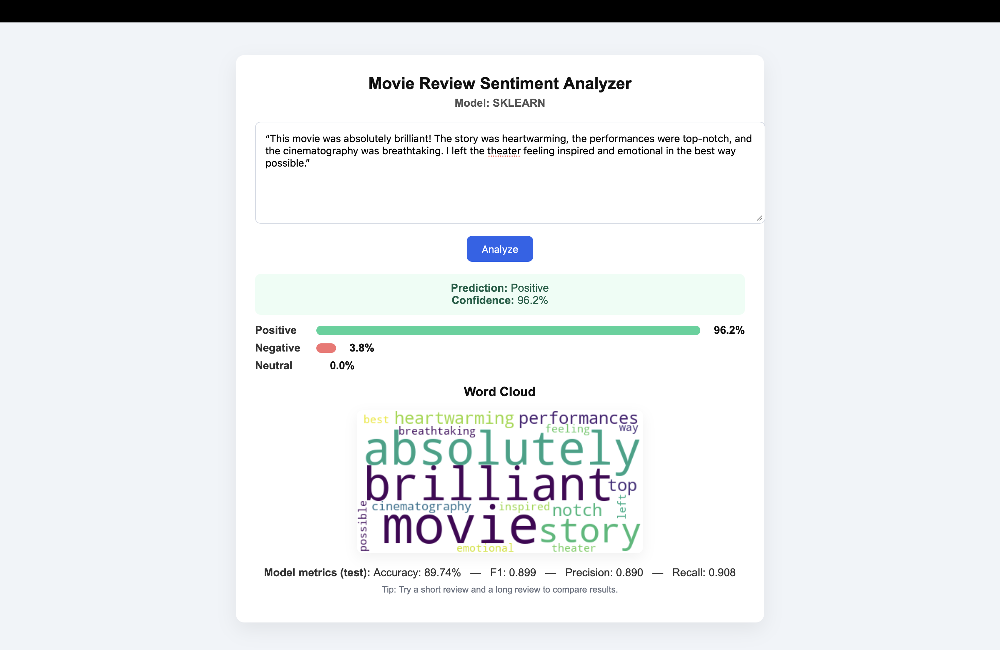
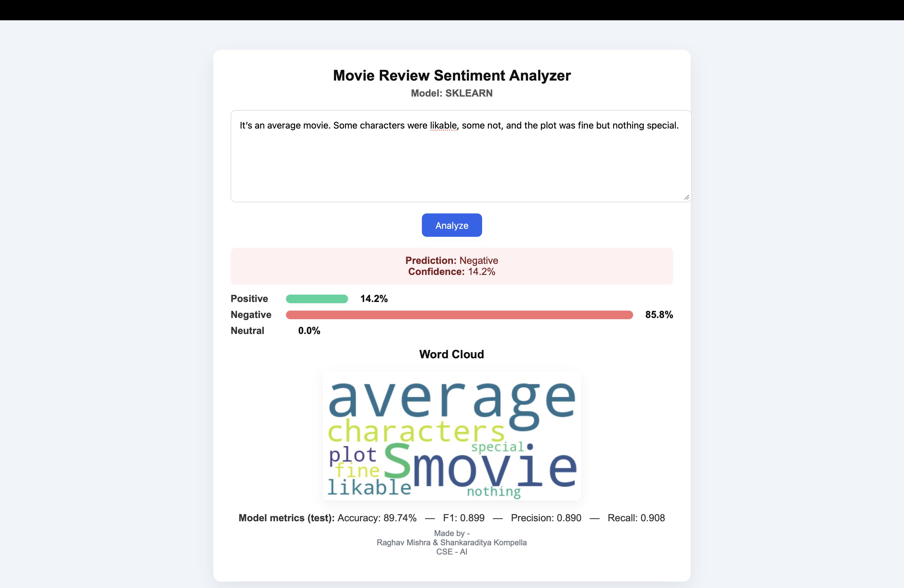

# 🎬 Movie Review Sentiment Analysis

A web-based application that classifies movie reviews as Positive, Negative, or Neutral using Natural Language Processing (NLP) techniques.

This project demonstrates both rule-based and machine learning approaches to sentiment analysis, allowing users to switch between models and observe differences in performance.

Built using Flask, it provides a simple and interactive interface for real-time predictions.

___

## 🚀 Features
	•	🔍 Real-time sentiment prediction
	•	🧠 Dual-model support:
	•	VADER (rule-based)
	•	TF-IDF + Logistic Regression (ML-based)
	•	🔄 Easy model switching via configuration
	•	🌐 Lightweight web interface using Flask
	•	⚡ Fast and responsive predictions

___

## 🧠 Models Used

## 🔹 VADER (Valence Aware Dictionary and sEntiment Reasoner)
	•	Rule-based sentiment analysis tool
	•	Designed for social media and short text
	•	No training required
	•	Fast and efficient

## 🔹 TF-IDF + Logistic Regression
	•	Converts text into numerical vectors using TF-IDF
	•	Logistic Regression used for classification
	•	Trained on 50,000 IMDB movie reviews
	•	Captures contextual patterns better than rule-based methods

___

## 🛠 Tech Stack
	•	Backend: Python, Flask
	•	Machine Learning: Scikit-learn, NLTK
	•	Frontend: HTML, CSS
	•	Dataset: IMDB 50K Movie Reviews

___

## ⚙️ Setup Instructions

### 1. Clone the repository
```bash
git clone https://github.com/your-username/movie-sentiment-analysis.git
cd movie-sentiment-analysis
```

### 2. Create virtual environment
 ```bash
python3 -m venv venv
```

### 3. Activate environment
```bash
source venv/bin/activate
```
### Windows:
```bash
.\venv\Scripts\Activate.ps1
```

### 4. Install dependencies
```bash
pip install -r requirements.txt
```

### 5. Run the application
```bash
python app.py
```

### 6. Open in browser
```bashhttp://127.0.0.1:5000
```
___

## 📂 Project Structure

```bash
.
├── app.py                  # Main Flask application
├── model/
│   ├── vader_model.py     # VADER sentiment logic
│   ├── sklearn_model.py   # TF-IDF + Logistic Regression model
├── templates/
│   └── index.html         # Frontend UI
├── static/
│   └── style.css          # Styling
├── images/
│   └── results/           # Output screenshots
└── requirements.txt
```

---

## 📊 Example

### Input:
	The movie was beautifully directed and emotionally engaging.

### Output:
	Sentiment: Positive
	
---

## 📸 Results

<p align="center">
  
</p>

<p align="center">
  
</p>

---

## ⚠️ Notes

- Switch models using `MODEL_CHOICE` in `app.py`
- First run with sklearn model will:
  - Download NLTK datasets  
  - Train the model  
  - Save it as `sentiment_model.pkl`  
- VADER works instantly without training  

---

## 💡 Future Improvements

- 🤖 Add Deep Learning models (LSTM / BERT)  
- 📊 Display confidence scores and probabilities  
- 🌍 Deploy using Render / AWS / Docker  
- 📱 Improve UI/UX for better user experience  
- 📁 Store user inputs and prediction history  

---

## 👨‍💻 Author

**Raghav Mishra**

---

## ⭐ Support

If you found this useful, consider giving this repository a ⭐ and contributing!
